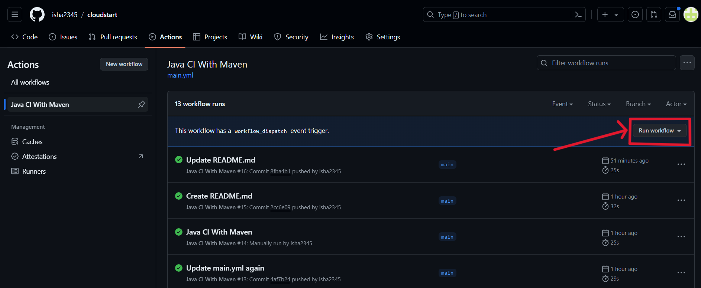

# CI/CD Pipeline Part 1

## Introduction
I've enhanced a foundational Java codebase by incorporating JUnit tests to validate each functional aspect. Subsequently, I've established a workflow that activates both manually and automatically in response to any committed changes.

## Part 1: Making changes from Git Bash
I made some changes in the code, and ran the following commands to trigger the workflow:
```
git add .
git commit -m "TRIGGER"
git pull origin main
pit push origin main
```

It activated the Workflow.


## Part 2: Making changes by editing the file in Github itself


## Part 3: Manually activating the workflow




